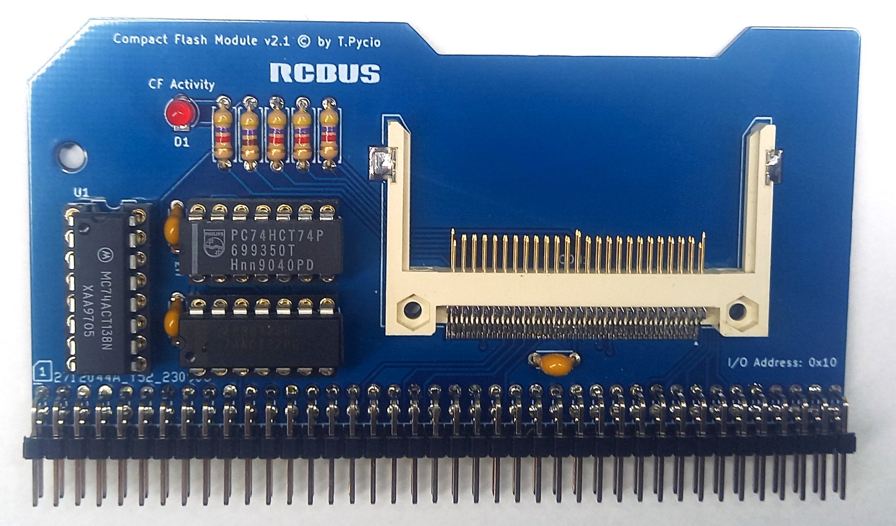

# Compact Flash Module for RCBus

CF card module in the RCBus standard, tuned to the Zilog bus time waveforms for the best compatibility with the CF standard. Compatible with most commercially available CF cards.

## Hardware Documentation

Documentation for the Previous Versions
[Version 2.0](https://github.com/tpycio/CFModule/tree/main/CF2.0)

### Schematic

[Schematic - Version 2.1](Schematic.pdf)

## Bill of Materials

| Component type     | Reference | Description                                   | Quantity |
| ------------------ | --------- | --------------------------------------------- | -------- |
| PCB                |           | Compact Flash Module PCB - Version 2.1        | 1        |
| Integrated Circuit | U1        | 74HCT138 - 3-to-8 line decoder, 16 pin DIP    | 1        |
| Integrated Circuit | U2        | 74HCT32 - Quad 2-input OR gate, 14 pin DIP    | 1        |
| Integrated Circuit | U3        | 74HCT74 - Dual D-type flip-flop, 14 pin DIP   | 1        |
| CF Socket          | CON1      | Attend 101D-TAAA-R01 Locating Peg:40.16mm, GF | 1        |
| LED                | D1        | LED indicator, 3 mm                           | 1        |
| Pin Header         | S1        | 2x40 pin header, 2.54 mm pitch, angle         | 1        |
| Capacitor          | C1 - C2   | 0.1 uF, 50V, MLCC, 5 mm pitch                 | 2        |
| Capacitor          | C3        | 1.0 uF, 50V, MLCC, 5 mm pitch                 | 2        |
| Resistor           | R1 - R4   | 4.7 kohm, 0.25 W, axial                       | 4        |
| Resistor           | R5        | 470 ohm, 0.25 W, axial                        | 1        |
| IC Socket          | U1        | 16 pin DIP                                    | 1        |
| IC Socket          | U2,U3     | 14 pin DIP                                    | 2        |

Gerber files prepared for production at JLCPCB

## Release Notes

### Changes

* Version 2.1:
  
  * Update form factor from RC2014 compatible to RCBus
  * Limiting the module's response to addresses in the range 0x10-0x1F

* Version 2.0
  
  * Initial version

## License

Copyright 2024 Tadeusz Pycio

This work is licensed under a [Creative Commons Attribution-NonCommercial 4.0 International (CC BY-NC 4.0) ](https://creativecommons.org/licenses/by-nc/4.0/).

### Trademarks

* "RC2014" is a registered trademark of RFC2795 Ltd.
* Other names and brands may be claimed as the property of others.